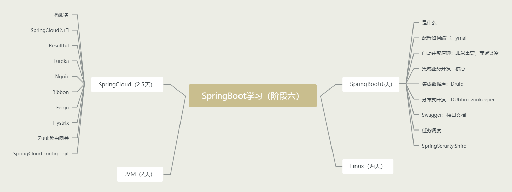
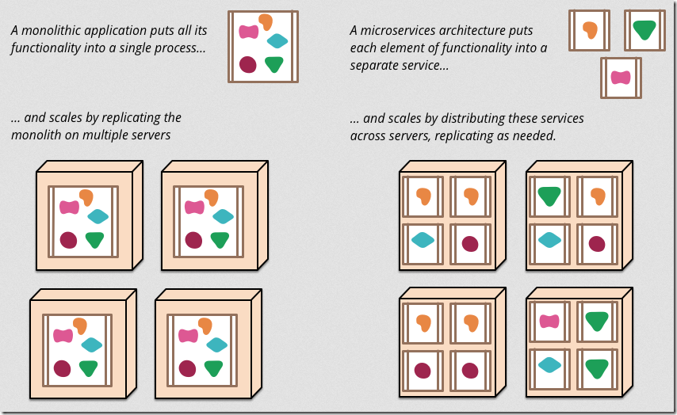
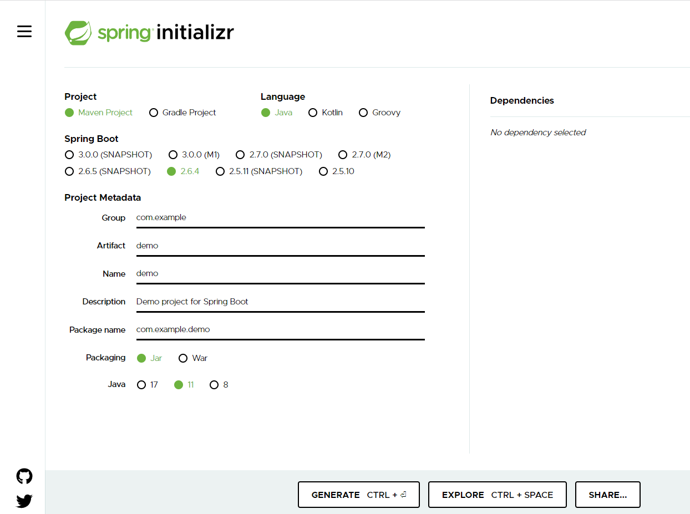
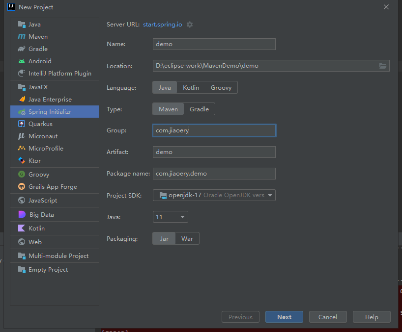
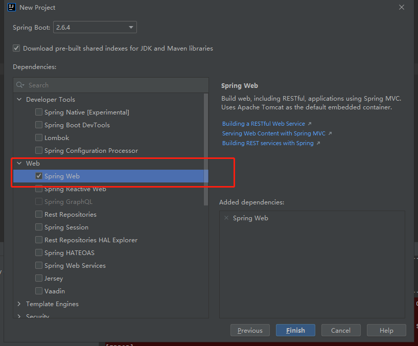

# SpringBoot学习

## 1.微服务阶段学习

javase：OOP

mysql：数据持久化

html+css+js+jquery+框架：视图，框架不熟练，css不好用

javaweb：独立开发MVC三层架构的网站（原始框架）

ssm：（**Spring+SpringMVC+MyBatis**）框架：简化了我们的开发流程，配置开始也比较复杂

war：tomcat的运行

spring简化：SpringBoot -jar 内嵌tomcat，微服务架构

服务会越来越多：如springcloud

### 1.1 学习路径

springboot

* 什么是springboot
* 配置如何编写 yaml
* `自动装配原理（非常重要）`
* 集成web开发
* 集成数据库
* 分布式开发：DUbbo+zookeeper
* swagger接口文档
* 任务调度
* SpringSerurty:Shiro

linux学习

springcloud

* 微服务
* springcloud入门
* Restful
* Eureka
* Ngnix
* Ribbon
* Feign
* Hystrix
* Zuul:路由网关
* SpringCloud config：git

JVM机制

## 2.什么是SpringBoot

**Spring Boot的主要优点：**

- 为所有Spring开发者更快的入门
- **开箱即用**，提供各种默认配置来简化项目配置
- 内嵌式容器简化Web项目
- 没有冗余代码生成和XML配置的要求

重点思想：Spring Boot 以**约定大于配置的核心思想**，默认帮我们进行了很多设置，多数 Spring Boot 应用只需要很少的 Spring 配置

## 3.什么是微服务

MVC 三层架构 MVVM 微服务架构

DUbbo：https://dubbo.apache.org/zh/docs/

原文文章地址：https://martinfowler.com/articles/microservices.html （作者：[Martin Fowler](https://martinfowler.com/)）

翻译版本：https://www.cnblogs.com/liuning8023/p/4493156.html

## 4.新手上路

环境：

* jdk 1.8
* maven
* springboot
* idea

官方：提供一个快速生产的网站，但是IDEA本身自带

### 4.1 网站初始化

网址：https://start.spring.io/

### 4.2 IDEA创建

选择依赖环境

