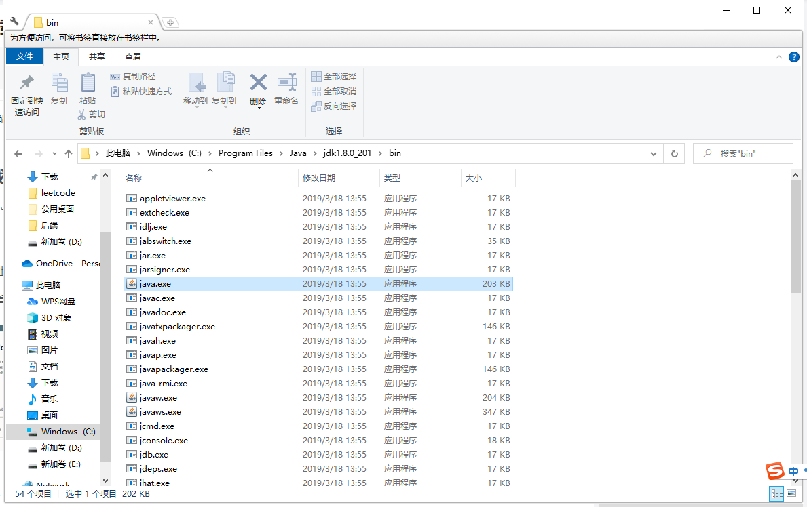
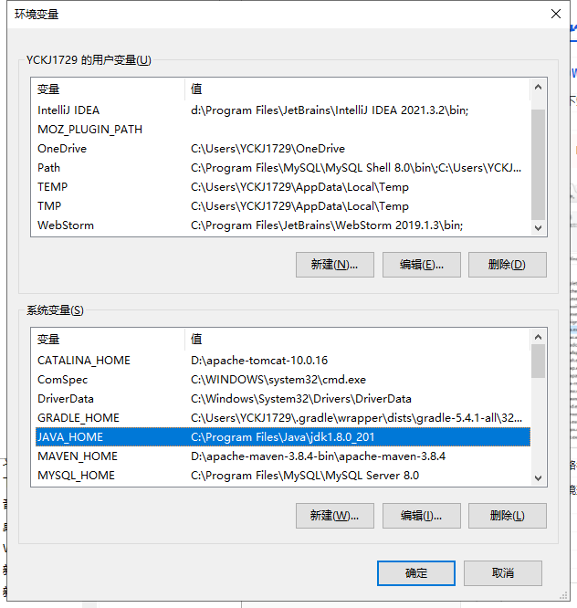
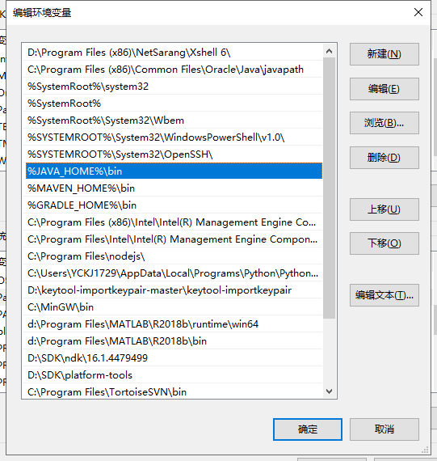
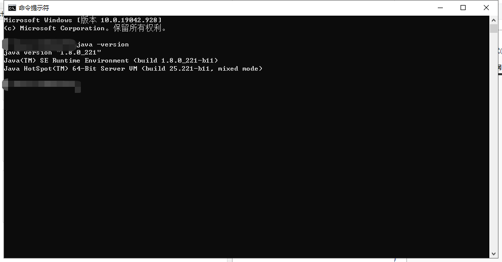

# 环境变量配置

## 1、java环境变量配置

### 1.1 Windows环境下

现在orcle官网下载JDK [点击这里](https://www.oracle.com/java/technologies/downloads/#java8)，下载对应版本的jdk，运行后完成安装，找到安装路径：

> C:\Program Files\Java\jdk1.8.0_201\bin

我们需要把这个路径配置到系统环境变量中去

首先打开系统环境变量的目录：`我的电脑-属性-高级系统设置-环境变量`

* 配置JAVA_HOME(idea中会用到)
* 配置path环境变量

完成后打开命令行，使用`java -version`

若是有版本号出现，那么JDK环境配置成功

### 1.2 Mac环境下

